# MiniMax H3 Conditioning and the Prompt Timeline

**MiniMax H3 Conditioning** prompts every segment of a MiniMax H3 video on one node. The
**Prompt Timeline** is its editor window, opened from the node's **Open Prompt Timeline** button.
Every edit in the window writes the node's own widgets or a chain of **MiniMax H3 Asset** nodes,
so the graph runs the same with the window closed. Graph:
[`minimax-h3-prompt-timeline.json`](workflows/minimax-h3-prompt-timeline.json), three scenes
joined by the three common transitions.

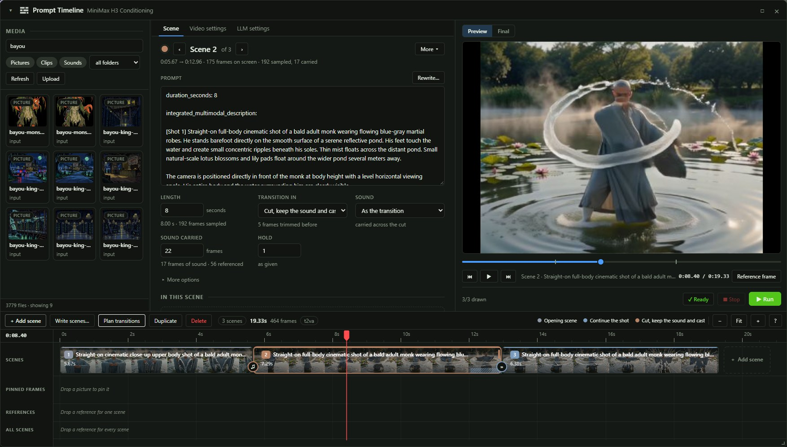

## The node

One row per segment. A new row appears as the last one is filled; the window adds and removes
rows itself.

| Row widget | Holds |
|---|---|
| `prompt_N` | The segment's prompt |
| `duration_N` | Its length in seconds, snapped to the model's 17-frame clip grid |
| `overlap_N` | Frames carried from the segment before, or the frames of sound or reference a cut reads |
| `continuity_N` | The transition into it, from the table under [Transitions](#transitions) |
| `source_N` | The segment it continues from: `-1` the one before, `2` segment 2 |
| `header_footer_N` | `both`, `header only`, `footer only` or `neither` of `prompt_header` and `prompt_footer` |
| `model_N` | `auto`, `fl2va` or `ref2va` |
| `strength_N` | How firmly it holds its pinned frames and references, `1.0` as given |
| `sound_N` | `auto`, `carry` or `fresh` |
| `seed_N` | `0` for the run's seed plus the segment number, any other value its own |

| Node widget or input | Holds |
|---|---|
| `mode` | `t2va`, `i2va`, `fl2va`, `fl2va_batched` or `ref2va` |
| `aspect_ratio`, `megapixels`, `width`, `height` | The canvas |
| `prompt_header`, `prompt_footer` | Text put before and after every row that takes them; a section a row writes itself replaces theirs |
| `ref_image_size` | The size reference pictures are encoded at |
| `loop` | Closes the last scene on the video's first frame |
| `assets` | The last node of a MiniMax H3 Asset chain |
| `vlm_clip` | A language model for the window's writing tools; never loaded by a render |

Every input, output and tooltip is in [`NODES.md`](../NODES.md) under **WAS Suite/Latent/Video**.

## The window

| Area | Shows |
|---|---|
| Media | Every picture, clip and sound the pack may read, by kind and folder; files dropped here upload to `ComfyUI/input` |
| Scene, Video settings, LLM settings | The chosen scene, the whole video, and the language model tools |
| Monitor | **Preview**, each segment as it samples, and **Final**, the video the run saved |
| Timeline bar | Add scene, Write scenes, Plan transitions, Duplicate, Delete, the run's length, the transition legend and zoom |
| Tracks | Scenes, Pinned frames, References and All scenes, on one time ruler |

## Tracks

| Track | Gesture | Result |
|---|---|---|
| Scenes | Click a scene | Chooses it for the Scene tab |
| Scenes | Drag a scene's right edge | Sets its length |
| Scenes | Drag a scene | Moves it to another position |
| Scenes | Double-click a scene | Puts the cursor in its prompt |
| Scenes | Click the round button between two scenes | Opens the transition menu |
| Scenes | Drag the round button | Sets the overlap; dragged to the edge it makes a hard cut |
| Scenes | Right-click a scene | Insert, duplicate, delete, colour |
| Pinned frames | Drop a picture | Pins it at that moment; near a scene's start or end it becomes the opening or closing frame |
| Pinned frames | Drag a keyframe marker | Moves it to another frame |
| References | Drop a picture, clip or sound | The scene's prompt names it as `<Picture N>`, `<Video N>` or `<Audio N>` |
| References | Drag a reference | Moves it to another scene, or onto All scenes |
| All scenes | Drop a file | Every scene's prompt can name it |
| Any | Click an asset | Shows it full size in the monitor |
| Ruler | Click or drag | Moves the playhead |

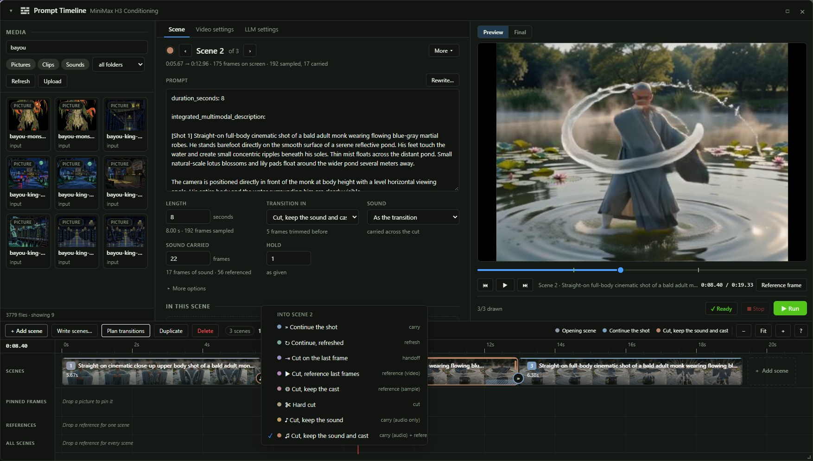

## Transitions

| In the window | `continuity_N` | Picture | Sound |
|---|---|---|---|
| Continue the shot | `carry` | The same shot goes on from its last frames | Carried |
| Continue, refreshed | `refresh` | The same shot, carried frames re-noised | Carried |
| Cut on the last frame | `handoff` | A new shot opening on the last frame | New |
| Cut, reference last frames | `reference (video)` | A new shot referencing the last frames | New |
| Cut, keep the cast | `reference (sample)` | A new shot referencing stills from the whole clip | New |
| Hard cut | `cut` | A new scene, nothing carried | New |
| Cut, keep the sound | `carry (audio only)` | A new scene | Carried across the cut |
| Cut, keep the sound and cast | `carry (audio) + reference (video)` | A new shot referencing the last frames | Carried across the cut |

A scene's **Sound** setting overrides the transition's: **Carry over** runs the last scene's sound
on across any cut, **Fresh** gives a carried shot new sound. A cut trims the 5 frames the model
renders past the last whole clip; the scene line under a scene's title gives the frames on screen,
sampled and carried.

## Scene tab

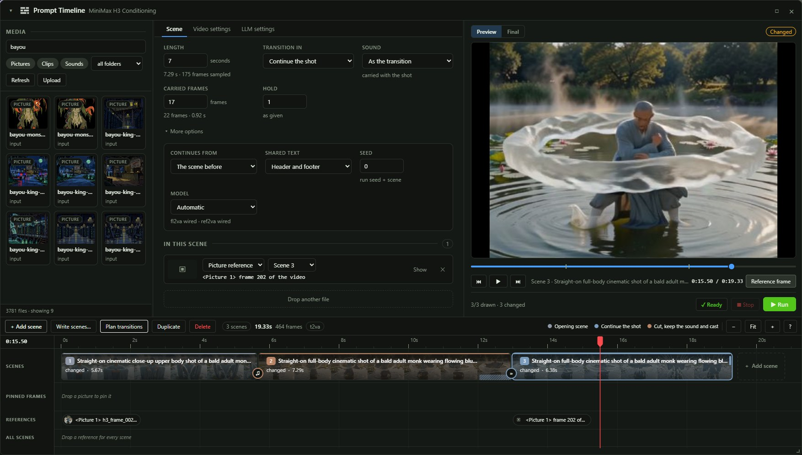

| Field | Sets |
|---|---|
| Prompt | The row's prompt; **Rewrite…** opens [Rewrite](#rewrite) |
| Length | `duration_N` |
| Transition in | `continuity_N` |
| Sound | `sound_N`: As the transition, Carry over, Fresh |
| Carried frames, Sound carried, Referenced frames | `overlap_N`, named for what the transition reads |
| Hold | `strength_N` |
| More options | Continues from `source_N`, Shared text `header_footer_N`, Seed `seed_N`, Model `model_N` |
| In this scene | Every asset placed on the scene, with its role and scene |

## Video settings tab

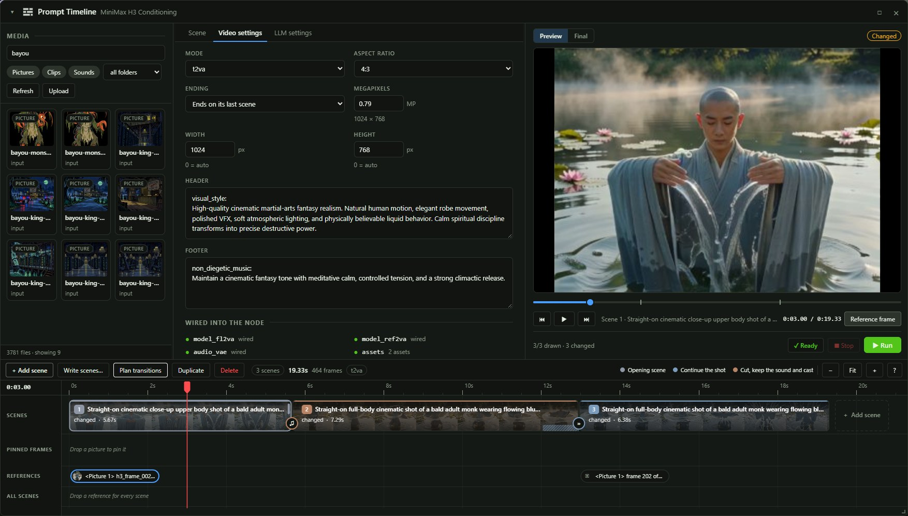

| Field | Sets |
|---|---|
| Mode | `mode` |
| Aspect ratio, Megapixels, Width, Height | The canvas; the line under Megapixels gives the size in pixels |
| Ending | `loop` |
| Header, Footer | `prompt_header`, `prompt_footer` |
| Wired into the node | Which inputs are connected |

## LLM settings tab

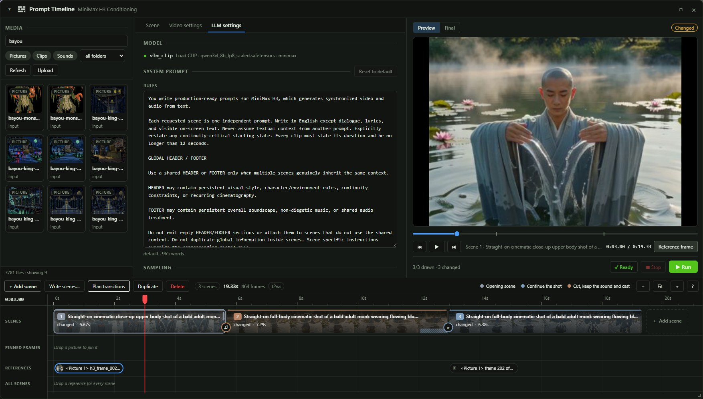

The tab's settings are saved with the workflow.

| Field | Sets |
|---|---|
| Model | The loader wired into `vlm_clip`, as Load CLIP with `qwen3vl_8b_fp8_scaled.safetensors` |
| System prompt | The rules every scene, header, footer and rewrite is written under; **Reset to default** restores the nodes' own |
| Temperature, Top P, Top K, Min P, Repetition penalty | How the model draws its words |
| Thinking | Lets a reasoning model think before each answer |
| Fast decode | Off decodes as core Generate Text |
| Transitions | **Planned** reads the written scenes back and picks each transition; **All cuts** cuts between every scene |
| Seed | **New each time**, or **Fixed** with a value |

Each writing job is a queued prompt of its own holding the model loader and one of **MiniMax H3
Scene Writer**, **MiniMax H3 Prompt Rewrite** or **MiniMax H3 Plan Transitions**, so it waits
behind any run already queued.

## Write scenes

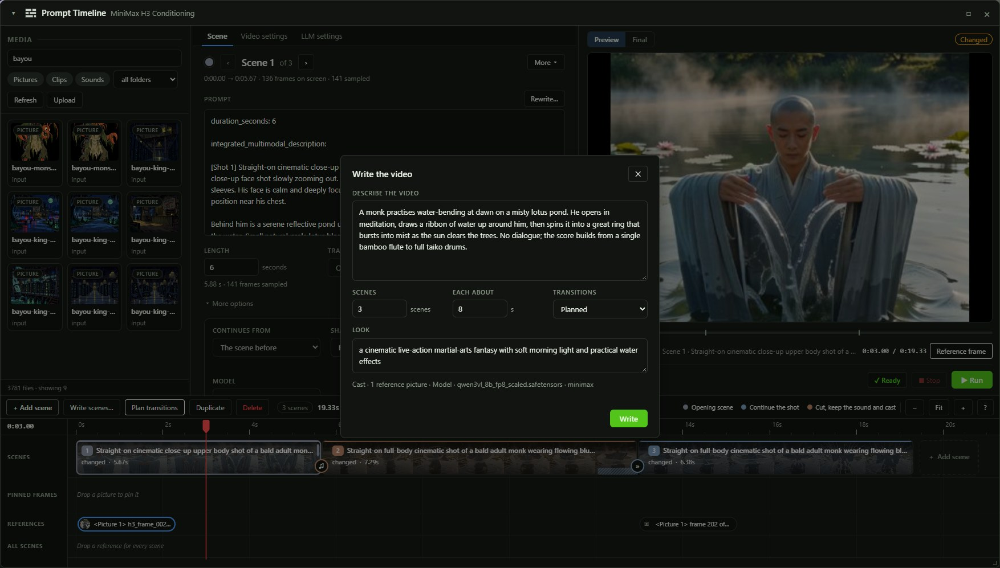

**Write scenes…** on the timeline bar opens the dialog; with no scene yet, the Scene tab shows it
in place. The model reads each reference picture in the asset chain, outlines the video, writes the
header, footer and every scene, and plans the transitions.

| Field | Sets |
|---|---|
| Describe the video | Who is in it, where it goes, what happens, who speaks which language |
| Scenes | How many, `1` to `24` |
| Each about | Seconds per scene, at most `12` |
| Transitions | Planned or All cuts |
| Look | The style, finishing "The target video is ..." |

**Apply** replaces every scene, the header, the footer and the reference pictures; pinned frames
stay, and Ctrl+Z restores the previous video.

## Rewrite

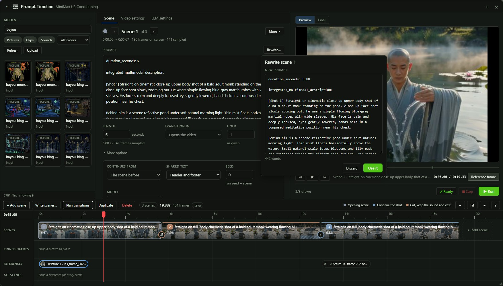

**Rewrite…** above the chosen scene's prompt rewrites it under the system prompt, keeping its
tags and dialogue unless the directions change them. An empty scene shows **Write…** and is
written from the directions. **Use it** replaces the prompt, as one undo.

## Plan transitions

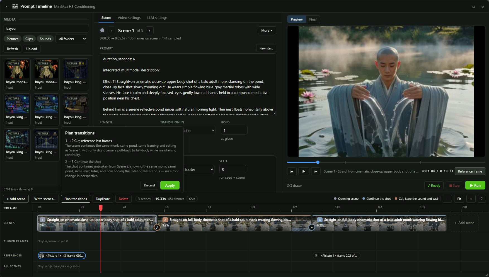

**Plan transitions** reads the scenes as they stand and picks each transition, with a reason for
each. **Apply** sets every row's transition and overlap. A scene with reference pictures of its own
is never given a cast transition.

## Monitor

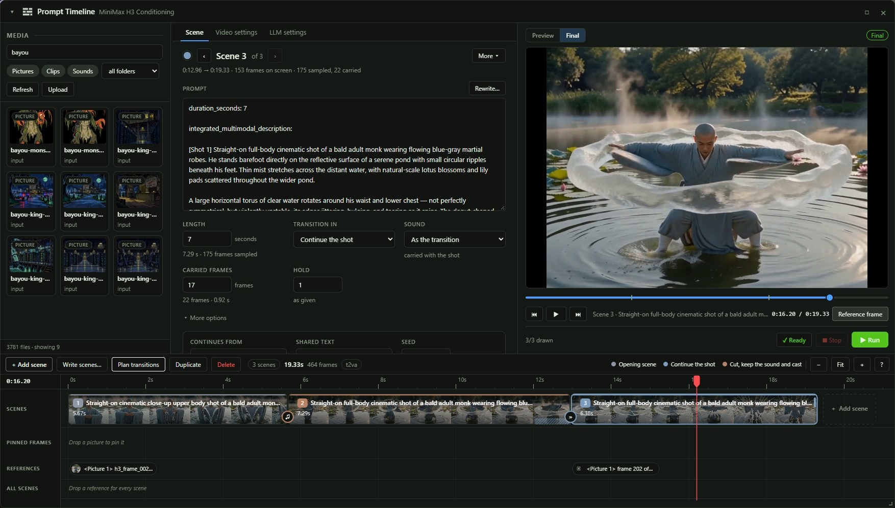

| Control | Does |
|---|---|
| Preview | Each segment as it samples, from a `taeh3` decoder in `ComfyUI/models/vae_approx`; the last step stays |
| Final | The video the run saved, with its sound, on the same playhead |
| Play, previous scene, next scene | Space, Home, End |
| Ready, N to fix | Lists what needs fixing before a run |
| Stop, Run | Stops the sampling run; queues the graph |
| Reference frame | Makes the frame under the playhead a picture reference |

| State | Means |
|---|---|
| Sampling · step | The segment is sampling now |
| Stopped | The run stopped part way through the segment |
| Changed | The scene was edited after its preview or the Final video was made |
| Different length | The saved video is not the length the timeline adds up to |

### Reference frame

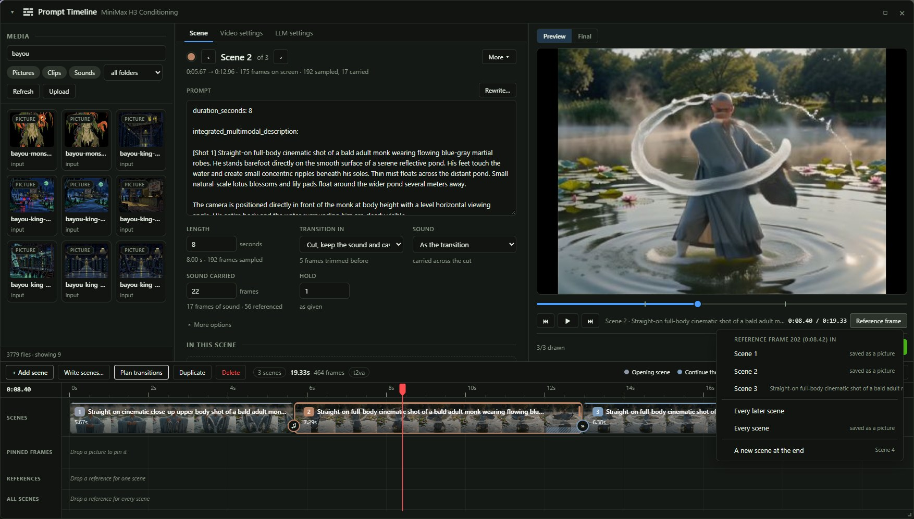

| Entry | Adds |
|---|---|
| A later scene | A MiniMax H3 Asset reading that frame from the video as it is made |
| This scene or an earlier one | The frame saved as a picture in `ComfyUI/input`, from Final where it holds the frame and the preview otherwise |
| Every later scene | The frame from the video, in every scene after it |
| Every scene | The saved picture, in every scene |
| A new scene at the end | A scene after the last, referencing the frame from the video |

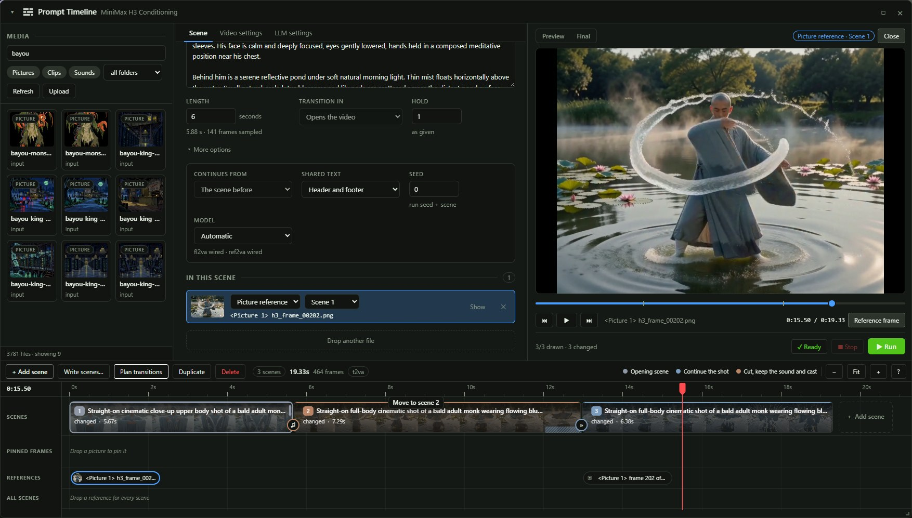

## Keys

| Key | Does |
|---|---|
| N | Adds a scene |
| D | Duplicates the chosen scene |
| Delete | Removes the chosen scene or asset |
| ← → | Chooses the scene before or after |
| Space | Plays from the playhead |
| Home, End | The start of this scene or the one before, the start of the next |
| V | Switches Preview and Final |
| + − F | Zoom in, zoom out, fit |
| Esc | Closes the full-size asset, the Write dialog, then the window |
| Ctrl+Z | Undoes the last gesture |

## Settings

| Setting | Under | Does |
|---|---|---|
| Show the Open Prompt Timeline button | WAS Node Suite, MiniMax H3, Prompt Timeline | Draws the button on MiniMax H3 Conditioning |

## Troubleshooting

| Seen | Fix |
|---|---|
| Idle Preview through a whole run | Put a `taeh3` decoder in `ComfyUI/models/vae_approx` and leave `live_preview` on H3 Extend Window |
| Write scenes asks for a language model | Wire Load CLIP with a language model into `vlm_clip` on MiniMax H3 Conditioning |
| Queued behind the runs ahead of it | The job starts when the runs ahead of it finish |
| Reference frame entries for this scene and earlier ones are greyed | Run the graph; a frame is saved once a preview or the Final video holds it |
| A frame reference dragged to an earlier scene springs back | A frame of the video reaches later scenes only; use Reference frame to save it as a picture for an earlier one |
| Final shows Different length | The saved video came from a run before the scenes changed length; run again |
| The window opens on an empty Scene tab | The node has no prompt yet; write one or use Write scenes |
