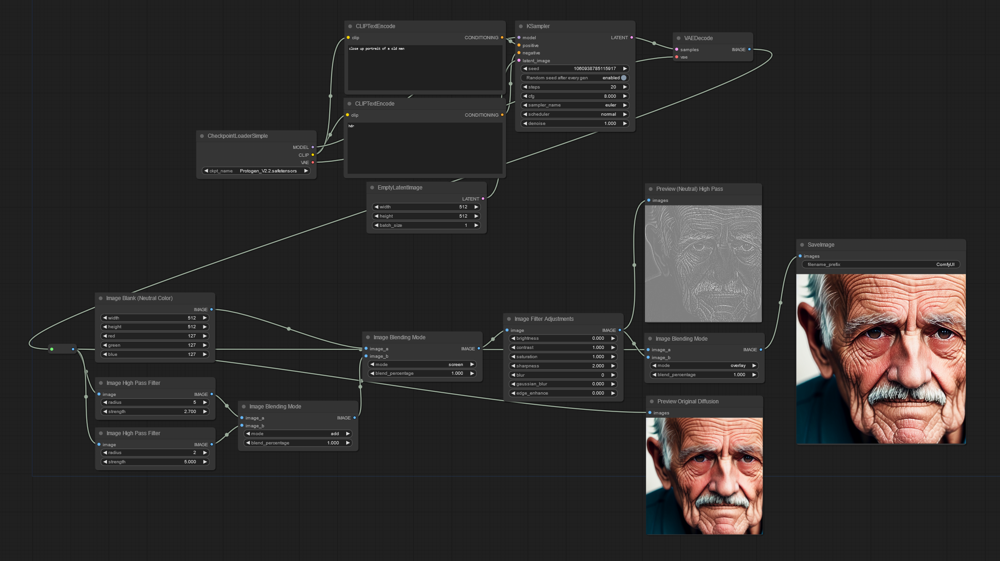

# WAS Node Suite Workflows

Load these image workflows into ComfyUI by simply loading them as if they were a .JSON file. 

PS; The `TAM_LOFI` model is a 50/50 mix of [LOFI](https://civitai.com/models/9052/lofi) and [The Ally's Mix III: Revolutions](https://civitai.com/models/10752/the-allys-mix-iii-revolutions) (18+ model)

## Autumn Color Tone with Gradient Mapping

## Several filters test workflow

## Bloom Image Workflow

## Wildcard Replacement Workflow

## High Pass Sharpening

## Procedural Rock Texture Generator

## Procedural Rock **Seamless** Texture Generator

## Load Batch Imges - Incremental Images

