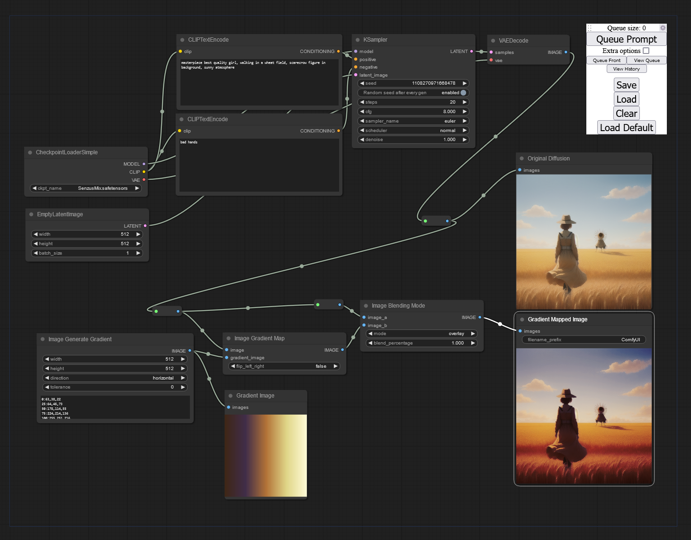
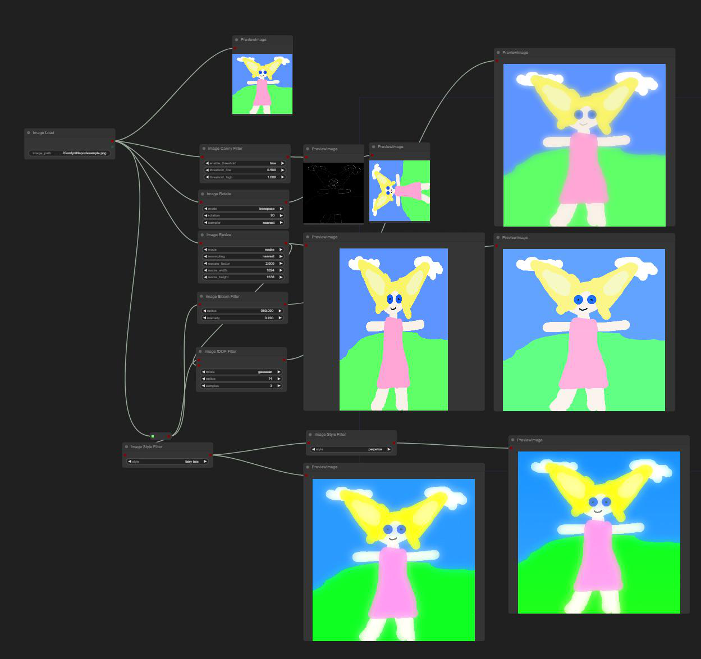
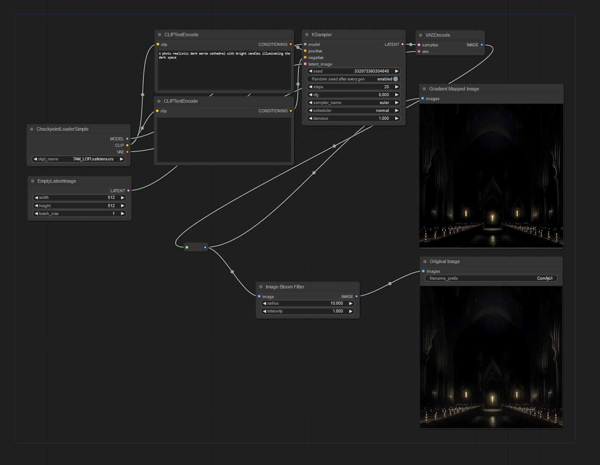
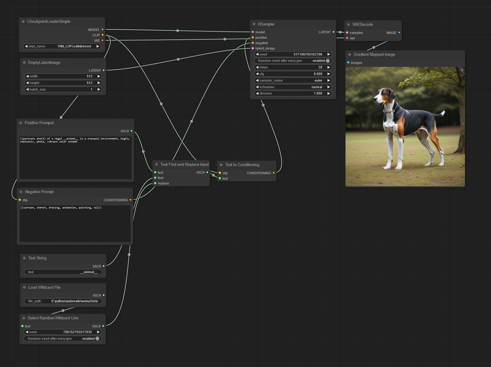

# WAS Node Suite Workflows

Load these image workflows into ComfyUI by simply loading them as if they were a .JSON file. 

## Autumn Color Tone with Gradient Mapping

## Several filters test workflow

## Bloom Image Workflow

## Wildcard Replacement Workflow

